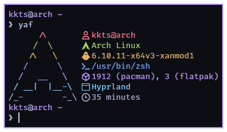

# Yet Another Fetch (yaf)



## Installation
```sh
cargo install --git https://github.com/kktsdev/yaf
```

## Usage
```
Usage: yaf [-d] [-v] [<config_path>]

Yet Another Fetch

Arguments:
  config_path        Config path, defaults to ~/.config/yaf.conf, uses builtin
                     config if the file does not exist.

Options:
  -d, --dump-config  Dumps builtin config to stdout.
  -v, --version      Prints version info.
  -h, --help         Show this help message and exit.
```

## Configuration
```sh
yaf -d > ~/.config/yaf.conf
vim ~/.config/yaf.conf
```
Buildin config:

```
{@color1}      /\         {$USER}@{uname -n}
{@color2}     /  \       󰣇 {lsb_release -a | grep Description | cut -f2}
{@color3}    /\   \      󰌽 {uname -r}
{@color4}   /      \      {$SHELL}
{@color5}  /   __   \     {pacman -Qq | wc -l}
{@color6} / __|  |__-\    {$XDG_SESSION_DESKTOP}
{@color7}/_-        -_\   {uptime -p}
```
- **Escaping in `{}`**: Prefix `{`, `}`, or `\` with `\` to include them literally (`{echo \{ \}}`)
- **Commands**: No prefix (`{uptime -p}`)
- **Env Vars**: Prefix with `$` (`{$USER}`)
- **Styles**: Prefix with `@` (`{@color1}`), available styles: `@color0` to `@color15`, `@bold`, `@italic`, `@underline`, `@reset`

## Uninstalling
```sh
cargo uninstall yaf
```
